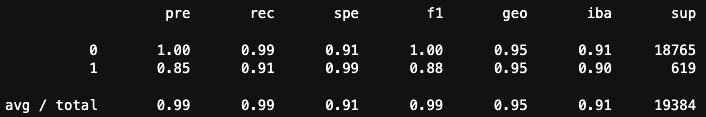
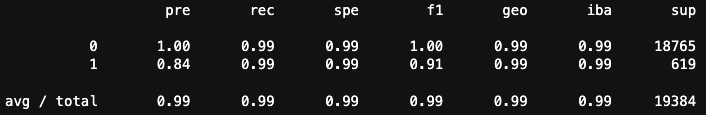

# Credit Risk Model using Supervised Learning

Credit risk poses a classification problem that’s inherently imbalanced. This is because healthy loans easily outnumber risky loans. This program will use logistic regression to train and evaluate models with imbalanced classes. Based on a dataset of historical lending activity, the program will build a model that can identify the creditworthiness of borrowers. 

----

## Technologies
This application is written in Jupyter Lab Notebook in the Python programming language. The Python libraries, tools, and modules used in this application are Pandas, NumPy, pathlib, scikit-learn, and imbalanced-learn. 

[Pandas](https://pandas.pydata.org/docs/index.html), [NumPy](https://numpy.org/doc/), [pathlib](https://docs.python.org/3/library/pathlib.html), [scikit-learn](https://scikit-learn.org/stable/), [imbalanced-learn](https://imbalanced-learn.org/stable/user_guide.html#user-guide)

----

## Installation Guide
This program uses the Pandas library. If the user is not already running an environment that includes Pandas, then they will need to intall the library. Instructions shown in the installation guide --> [Pandas Installation Guide](https://pandas.pydata.org/docs/getting_started/install.html)

For the program to run correctly, the user must make sure that all libraries and modules are correctly imported in the beginning of the code. This looks like:

    import numpy as np
    import pandas as pd
    from pathlib import Path
    from sklearn.metrics import balanced_accuracy score
    from sklearn.metrics import confusion_matrix
    from sklearn.model_selection import train_test_split
    from sklearn.linear_model import LogisticRegression
    from imblearn.metrics import classification_report_imbalanced
    from imblearn.over_sampling import RandomOverSampler

----

## Usage

**The program is comprised of 3 main parts:**

1. Split the Data into Training and Testing Sets

2. Create a Logistic Regression Model with the Original Data

3. Predict a Logistic Regression Model with Resampled Training Data

----

## Credit Risk Analysis Report

### Overview of the Analysis

The purpose of this analysis was to identify credit risk of borrowers. The lending data that was analyzed to determine creditworthiness was comprised of loan size, interest rate, borrower income, debt to income ratio, number of accounts, total debt and derogatory marks. Additionally, there was a column called loan status, that showed either a 1 or 0 (1 meaning the loan is high-risk and 0 meaning the loan is healthy). The program was meant to use this information to predict how many healthy loans and high-risk loans there will be in the future. To do this, the program followed a machine learning process - model, fit, predict, evaluate. The data was split into training and testing datasets using scikit-learn. The training data was then taken through, and fit to a LogisticRegression model. Then the model was able to use the testing data to predict future loans. Lastly, using functions from scikit-learn and imbalanced-learn, the program evaluated the model's performance. Performance showed a decline, most likely due to an inbalance in classes. To fix this, the program used RandomOverSampler to balance the classes and then run a new, more weighted model. After running the new logistic regression with the balanced classes, loans were predicted with much higher accuracy. 

### Results

Machine Learning Model 1:
  * Balanced Accuracy Score : 0.9520
      * The model was about 95% correct in it's predictions.
      * Want a score closer to 1 for our model.
  
  * Confusion Matrix : [18663, 102
                         56, 563]
      * 18663 True Positive results, 56 False Positive results, 102 False Negative resuls, and 562 True Negative results.
      * The model correctly classified 18663 Positive and 563 Negative results. 
      * Want to increase number of True results and decrease the number of False results.
      
  * Classification Report 
      
      * Precision (pre), recall (rec), and f1 (f1) scores are all very good for the high-risk loans, but not at all accurate enough for healthy loans.
      * Want to increase the scores for healthy loans to match high accuracy of high-risk loan scores.

Machine Learning Model 2:
  * Balanced Accuracy Score : 0.9936
      * The model was about 99% correct in it's predictions.
      * This model is more accurate than Model 1.
  * Confusion Matrix : [18649, 116
                         4, 615]
      * Decrease in True Positive, increase in False Positive, decrease in False Negative, increase in True Negative.
      * These numbers will better for recall and f1 scores.
  * Classification Report
      
      * For high-risk loans, the scores for precision, recall, and f1 did not change, showing they remain highly accurate.
      * The precision, recall, and f1 scores for healthy loans are now .84, .99, and .91 respectively.
      * Model predicts healthy loans more accurately than Model 1.

## Summary

After resampling the data to provide balanced classes, the new model predicted both loans more accurately. This is shown by the increased balanced acccuracy score, and the increased precision, recall, and f1 numbers provided by the classification report. I would recommend using the second logistic regression model to better identify creditworthiness of borrowers.

----

## Contributors

Arlie Jones

[E-mail](arliejones98@gmail.com)  |  [LinkedIn](https://www.linkedin.com/in/arlie-jones-020092159/)

----

## License

None
